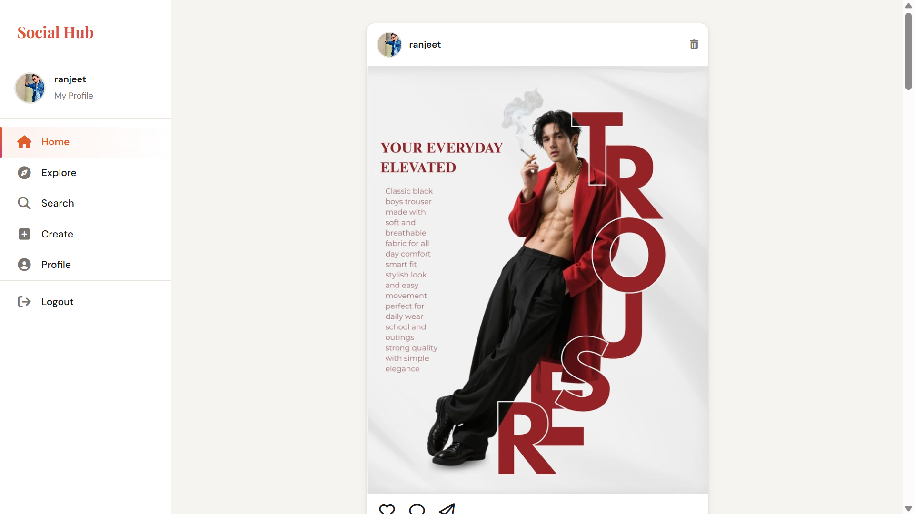
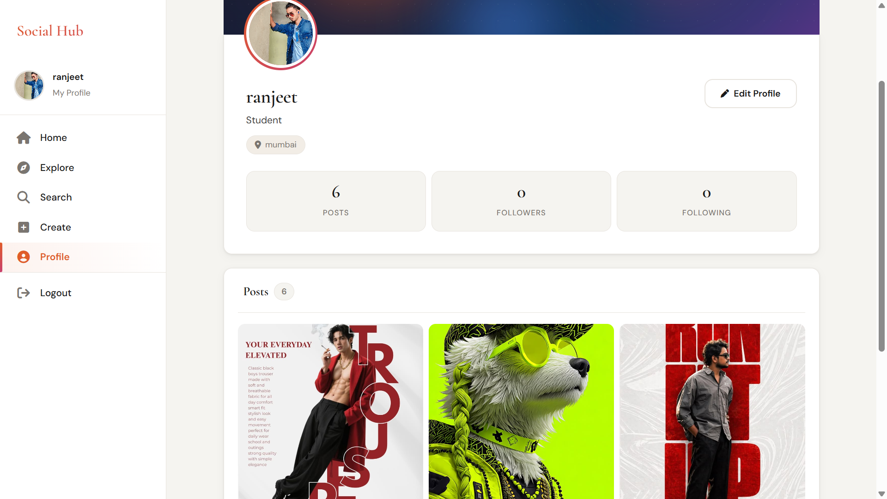
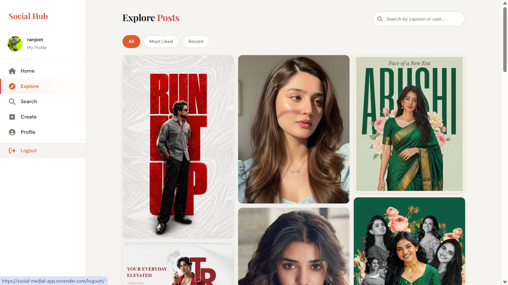

# 🌐 Social Media App


A feature-rich **Django Social Media Application** where users can create accounts, upload posts, like posts, follow other users, search profiles, and explore content.

## 🚀 Live Demo

👉 https://social-medial-app.onrender.com

---

# 📸 Screenshots

<p align="center">
  
  
  
</p>

---

# ✨ Features

## 👤 Authentication
- User Registration
- Login & Logout
- Secure Authentication
- User Profile Management

## 📸 Posts
- Upload Images
- Add Captions
- Delete Own Posts
- Personalized Feed
- Explore Posts

## ❤️ Social Features

- Like & Unlike Posts
- Follow / Unfollow Users
- User Search
- Profile Statistics
- Followers & Following Count

---

# 🛠 Tech Stack

| Technology | Used For |
|------------|----------|
| Python | Backend |
| Django | Web Framework |
| SQLite3 | Database |
| Cloudinary | Image Storage |
| HTML | Frontend |
| CSS | Styling |
| JavaScript | Client-side Functionality |
| WhiteNoise | Static Files |
| Gunicorn | Production Server |

---

# 📁 Project Structure

```text
social-medial-app/
│
├── socialmedia/
│   ├── screenshots/
│   ├── settings.py
│   ├── urls.py
│   ├── asgi.py
│   └── wsgi.py
│
├── userauth/
│
├── templates/
│
├── static/
│
├── media/
│
├── manage.py
├── requirements.txt
├── db.sqlite3
└── README.md
```

---

# ⚙ Installation

### Clone Repository

```bash
git clone https://github.com/ranjeetkanojya39/social-medial-app.git
cd social-medial-app
```

### Create Virtual Environment

```bash
python -m venv venv
```

### Activate Environment

Windows

```bash
venv\Scripts\activate
```

Linux / macOS

```bash
source venv/bin/activate
```

### Install Dependencies

```bash
pip install -r requirements.txt
```

### Apply Migrations

```bash
python manage.py migrate
```

### Create Admin User

```bash
python manage.py createsuperuser
```

### Run Server

```bash
python manage.py runserver
```

Open

```
http://127.0.0.1:8000
```

---

# 🌍 Environment Variables

Create a `.env`

```env
SECRET_KEY=your_secret_key

DEBUG=True

CLOUDINARY_CLOUD_NAME=your_cloud_name

CLOUDINARY_API_KEY=your_api_key

CLOUDINARY_API_SECRET=your_api_secret
```

---

# 🚀 Deployment

This project is deployed using

- Render
- Cloudinary

Production Server

```
gunicorn socialmedia.wsgi
```

---

# 🔐 Security

- CSRF Protection
- Django Authentication
- Password Validation
- Environment Variables
- ORM Protection against SQL Injection

---

# 📌 Future Improvements

- Comments
- Notifications
- Direct Messaging
- Edit Posts
- Hashtags
- Infinite Scroll
- User Recommendations

---

# 🤝 Contributing

1. Fork Repository

2. Create Branch

```bash
git checkout -b feature-name
```

3. Commit

```bash
git commit -m "Add Feature"
```

4. Push

```bash
git push origin feature-name
```

5. Create Pull Request

---

# 👨‍💻 Author

**Ranjeet Kanojya**

📧 ranjeetkanojya39@gmail.com

🐙 GitHub

https://github.com/ranjeetkanojya39

---

# ⭐ Support

If you like this project, give it a ⭐ on GitHub.

---

Made with ❤️ using Django
